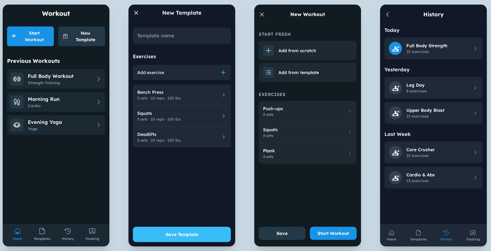

# 🏋️ RepNote

## **RepNote** is a minimalist workout tracking app with a mobile-style interface designed to simulate a phone experience directly in the browser, built with React, TailwindCSS, and Redux Toolkit

## 🎨 Concept Design

Below is the planned UI for Repnote. The current build is still in early development, but this shows the direction I'm aiming for.



## ✨ Features

- 👤 Onboarding via name input
- 📱 **Mobile-style layout** (375x812) for showcasing in browser
- 🧩 Workout **template creation**
- 🗂️ Saved templates & planned exercises
- 🔁 Global state with **Redux Toolkit**
- 📍 Page routing with **React Router**
- 🧠 Designed for simplicityand demo effectiveness

---

## 🧪 Demo Goals

This app is designed as a **developer portfolio project** to demonstrate:

- Clean and scalable React architecture
- State management patterns with Redux
- Local UI design via TailwindCSS
- Data flow in medium-complexity fitness tools

---

## 📌 Tech Stack

- React + Vite
- Redux Toolkit
- React Router
- TailwindCSS

---

## 🚧 Work in Progress

See [TODO](TODO.md) for full roadmap.

## 🧑‍💻 Getting Started

```bash
git clone https://github.com/funcnroll/repnote.git
cd repnote
npm install
npm run dev
```

## 📜 License

This project is licensed under the [MIT License](LICENSE).
