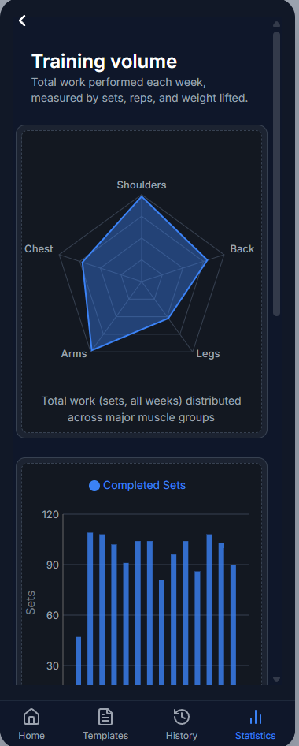
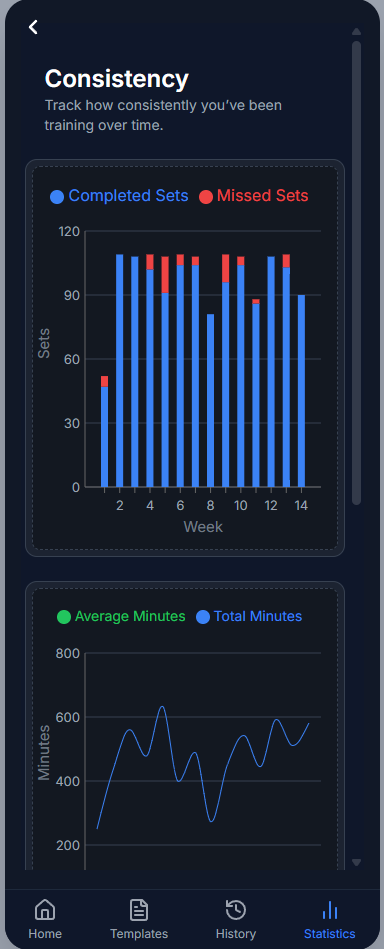
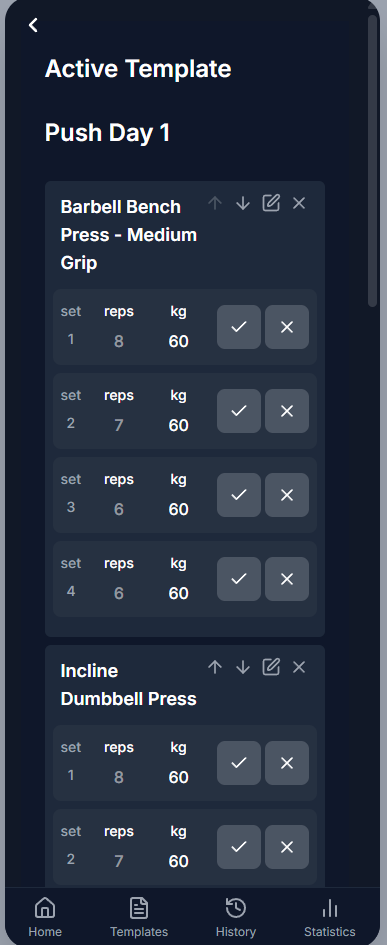
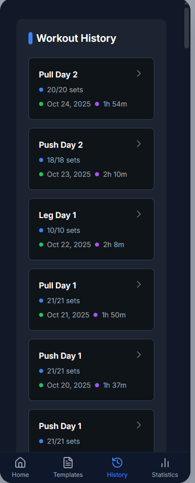

# 🏋️ RepNote

## **RepNote** is a minimalist training log and performance dashboard, built with a strong focus on **data visualization**. It simulates a mobile-style interface directly in the browser, allowing users to log workouts and instantly see trends in **strength, volume, and consistency**.

---

## 📱 App Preview

<div align="center">
  
  
  
  
</div>

---

## ✨ Features

- 👤 **Onboarding**
  - Simple name-based setup for personalization

- 🧩 **Training Templates**
  - Create and edit custom training plans
  - Add, remove, and reorder exercises
  - Draft vs. saved templates (edit vs. workout mode)

- 💪 **Workout Logging**
  - Track sets, reps, and weight during training
  - Edit exercises and sets mid-session
  - Resume active workouts from local storage
  - Per-set completion indicators

- 🗂️ **Exercise Library**
  - Searchable library of common exercises
  - Add or modify sets dynamically

- 📈 **Statistics & Data Visualization**
  - **Training Volume**
    - Weekly totals for sets, reps, and weight
    - Radar chart of sets distributed across muscle groups
  - **Performance**
    - One Rep Max (1RM) progression estimates
    - Volume load trends over time
  - **Consistency**
    - Completed vs. missed sets
    - Workout duration tracking
    - Weekly adherence / streaks

- 🧠 **Data Layer**
  - Global state management with Redux Toolkit
  - Local storage persistence
  - Seeded with months of realistic sample data (progression + partial sessions)

- 🎨 **UI/UX**
  - Mobile-style layout (375x812) for browser demo
  - Smooth navigation with React Router
  - TailwindCSS design system

---

## 🧪 Demo Goals

RepNote was built as a **developer portfolio project** to highlight:

- 🏗️ **Scalable React Architecture**  
  Clean, modular components with reusable chart and layout primitives.

- 📊 **Data Visualization in Practice**  
  Transforming workout data into meaningful charts with Recharts.

- 🔄 **State Management with Redux Toolkit**  
  Predictable flows for templates, active workouts, and workout history.

- 🎨 **UI/UX Exploration**  
  A mobile-style browser experience, styled with TailwindCSS.

- 🗂️ **Local Data Persistence**  
  Templates and workout history stored in local storage for instant demo use.

- 💡 **Experimentation & Play**  
  A sandbox for exploring UI ideas, workout data structures, and consistency tracking.

---

## 📌 Tech Stack

- React + Vite  
- Redux Toolkit  
- React Router  
- TailwindCSS  
- Recharts  

---

## 🧑‍💻 Getting Started

```bash
git clone https://github.com/funcnroll/repnote.git
cd repnote
npm install
npm run dev
